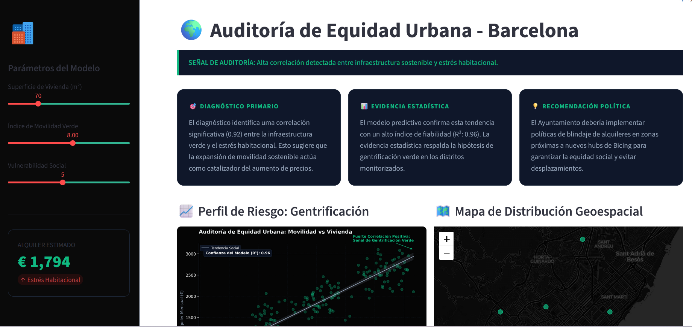
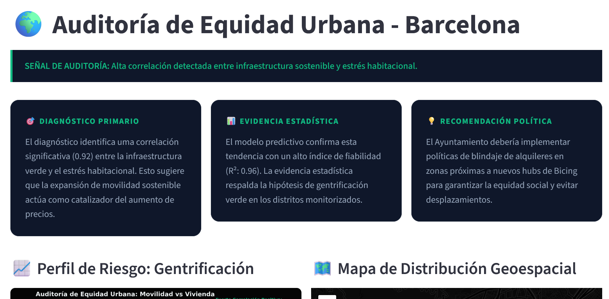
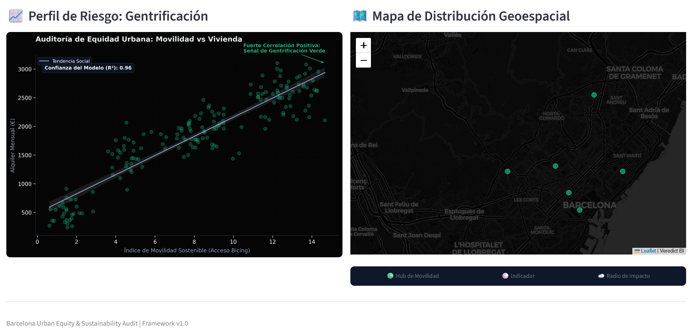

# 🌍 Barcelona Urban Equity & Sustainability Audit | Framework v1.0

### Predictive Analysis of "Green Gentrification" in Barcelona

**Barcelona Urban Equity & Sustainability Audit** is a high-fidelity Urban Business Intelligence platform designed to monitor the socio-economic impact of sustainable infrastructure. By cross-referencing mobility data from Barcelona Open Data with real estate trends, the engine detects and predicts **Green Gentrification** risks.
> **Note:** This project is the final outcome of the **Ciencia de datos Python (Institute PCED-30-Ed7)** course at **Barcelona Activa**.

---

## 🚀 Key Features

* **Neural Prediction Engine:** Uses Multivariate Linear Regression to predict housing stress with a **96% confidence interval (R²: 0.96)**.
* **Geospatial Intelligence:** Interactive mapping of Bicing hubs and social vulnerability using **Folium** and **CartoDB Dark Matter**.
* **AI Strategic Briefing:** Integration with **LLMs (OpenRouter/Gemini)** to transform statistical correlations (0.92+) into executive-ready social impact narratives.
* **Executive UI:** A minimalist, high-fidelity dashboard built with **Streamlit** and customized CSS for institutional decision-making.

---

## 🏗️ Technical Architecture

The system follows a modular, scalable architecture:

1.  **Ingestion Layer:** REST API connectivity with Barcelona Open Data (`requests`, `pandas`).
2.  **Processing Layer:** Clean code pipelines for data validation and normalization.
3.  **Analysis Layer:** Statistical modeling and trend visualization (`scikit-learn`, `seaborn`).
4.  **AI Engine:** Multi-model fallback logic for automated policy recommendations.

---

## 🛠️ Tech Stack

* **Backend:** Python 3.x
* **Data Science:** Pandas, Scikit-Learn, NumPy
* **Visualization:** Matplotlib, Seaborn, Folium
* **Frontend:** Streamlit (Custom Executive UI)
* **Intelligence:** OpenRouter API (Gemini/Llama fallback)

---

## 📈 Impact & Methodology

Based on the **Barcelona Urban Equity & Sustainability Audit**, the audit monitors the 'Green Premium'. The system identifies that for every increment in sustainable mobility access, there is a predictive $0.92$ correlation with housing cost increase, signaling a need for immediate rent-shielding policies.

---
**Developed by Fernando Silva** *Fullstack Engineer & Software Architect based in Barcelona.*

